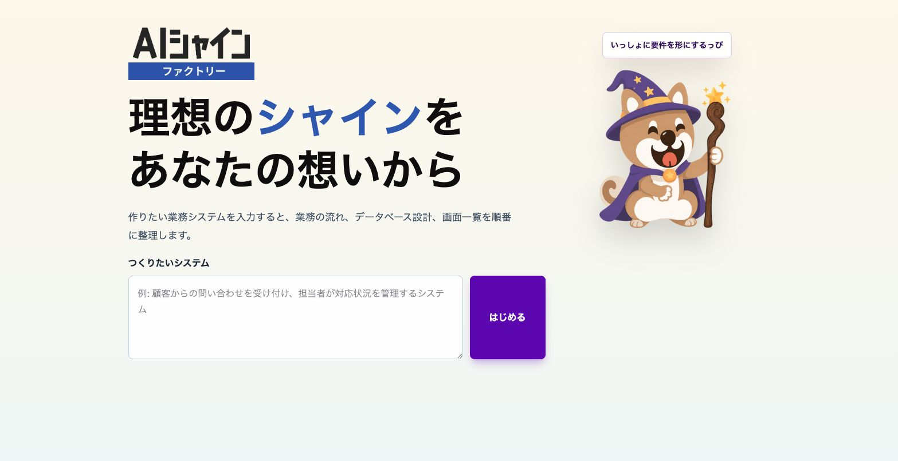
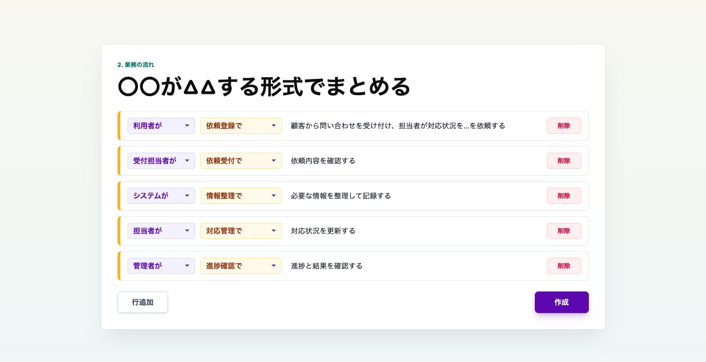
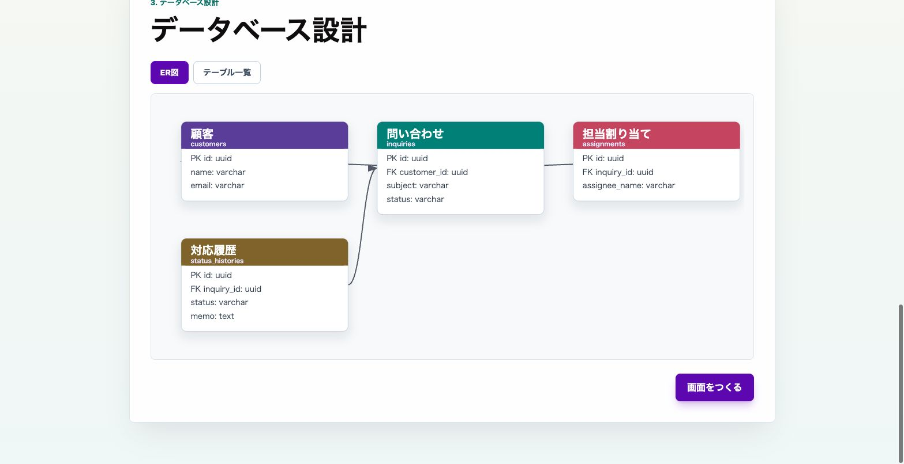
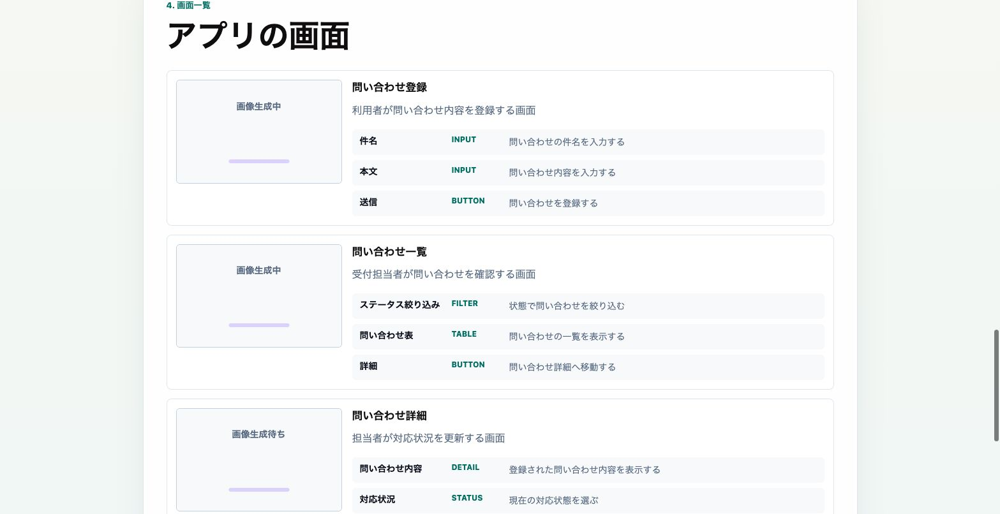
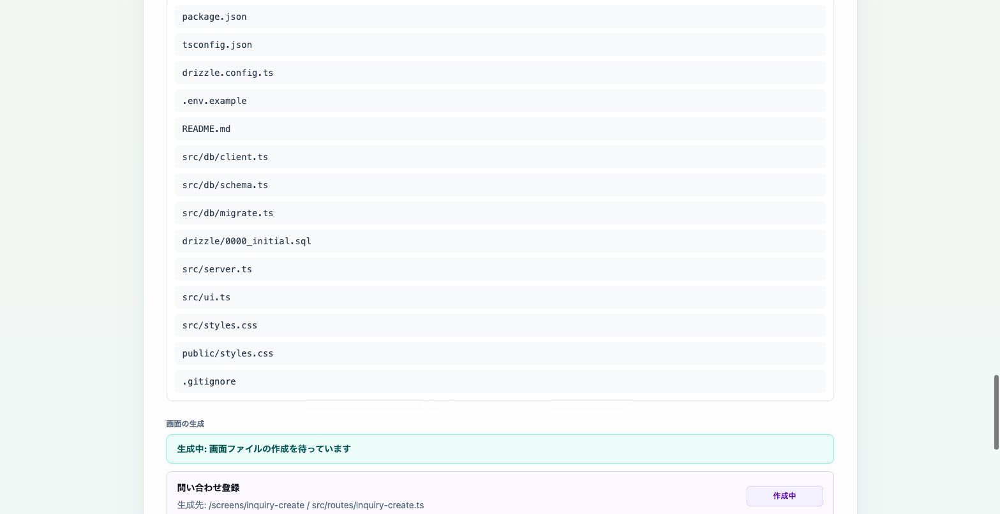

# AI社員ファクトリー

AI社員ファクトリーは、作りたい業務システムの説明から、業務フロー、データベース設計、画面一覧、生成プロジェクトのたたき台までを順番に組み立てるローカル開発用プロトタイプです。



入力欄に「こんな業務システムを作りたい」と書くと、ナッピーと一緒に要件を整理していく画面です。

## 画面の流れ

### 2. 業務の流れ

入力した要望を、誰が・どの画面で・何をするかの形に分解します。



### 3. データベース設計

業務の流れから必要なテーブルを洗い出し、ER図とテーブル一覧で確認できます。



### 4. 画面一覧

必要な画面と要素を一覧化し、次の開発ステップへつなげます。



### 5. 開発

生成されたベースプロジェクトのファイルと、各画面ファイルの生成状況を確認できます。



## できること

- 日本語のシステム要望から、アクター・画面・操作を含む業務フローを生成
- 業務フローをもとにテーブル定義とER図を作成
- 必要な画面一覧と画面要素を整理
- Codex画像生成が使える環境では画面イメージを生成し、失敗時はSVGフォールバックを表示
- 生成した設計からHono + Tailwind + Drizzle構成のベースプロジェクトを`gen_src/`に作成
- 作業途中のドラフトを`data/`配下に保存、再読み込み

## 必要なもの

- Node.js 20以上
- pnpm
- Codex CLI / Codexデスクトップアプリ
- Codexにログイン済みの環境

通常起動では`codex app-server`を同時に立ち上げ、アプリから`ws://127.0.0.1:8080`へ接続します。業務フロー、DB設計、画面設計、画像生成、コード生成はCodex app serverを通して実行します。

CodexなしでUIの流れだけ確認したい場合は、モックプロバイダーを使えます。

## セットアップ

```bash
pnpm install
pnpm build:app
pnpm build:css
pnpm start
```

`pnpm start`は以下を同時に起動します。

- `codex app-server --listen ws://127.0.0.1:8080`
- `tsx src/server.ts`

起動後、ブラウザで`http://localhost:8791`を開きます。

開発中は以下を使うと、CSS、フロントエンドTypeScript、サーバーをまとめてwatchできます。

```bash
pnpm dev
```

## モックで起動する

Codexサーバーを使わずに試す場合は、生成系をモックに切り替えて起動します。

```bash
WORKFLOW_PROVIDER=mock DATABASE_PROVIDER=mock SCREEN_PROVIDER=mock pnpm app:start
```

watch付きで開発したい場合は、従来どおり`pnpm dev`も使えます。この場合、Codex app serverは自動起動しないため、必要に応じて別ターミナルで`pnpm codex:server`を実行してください。

## 環境変数

| 変数 | 既定値 | 内容 |
| --- | --- | --- |
| `PORT` | `8791` | アプリのHTTPポート |
| `CODEX_SERVER_WS_URL` | `ws://127.0.0.1:8080` | Codex JSON-RPC WebSocketサーバーURL |
| `WORKFLOW_PROVIDER` | `codex-server` | `mock`を指定すると業務フロー生成をモック化 |
| `DATABASE_PROVIDER` | `codex-server` | `mock`を指定するとDB設計生成をモック化 |
| `SCREEN_PROVIDER` | `codex-server` | `mock`を指定すると画面設計生成をモック化 |
| `CODEX_WORKFLOW_TIMEOUT_MS` | `120000` | 業務フロー生成のタイムアウト |
| `CODEX_DATABASE_TIMEOUT_MS` | `120000` | DB設計生成のタイムアウト |
| `CODEX_SCREEN_TIMEOUT_MS` | `120000` | 画面設計生成のタイムアウト |
| `CODEX_SCREEN_IMAGE_TIMEOUT_MS` | `180000` | 画面画像生成のタイムアウト |
| `CODEX_DEVELOPMENT_TIMEOUT_MS` | `600000` | 生成プロジェクトへの画面実装タイムアウト |

## ディレクトリ

```text
src/                 サーバー、UI、生成ロジック
public/              ブラウザ配信用の静的ファイル
public/assets/       ロゴやキャラクター画像
data/                作業途中ドラフトの保存先
gen_src/             生成されたベースプロジェクトの出力先
```

`data/draft-*.yaml`、`public/generated/`、`gen_src/`は実行時に作られるためGit管理から外しています。

## 検証

```bash
pnpm type-check
```

## ライセンス

MIT
